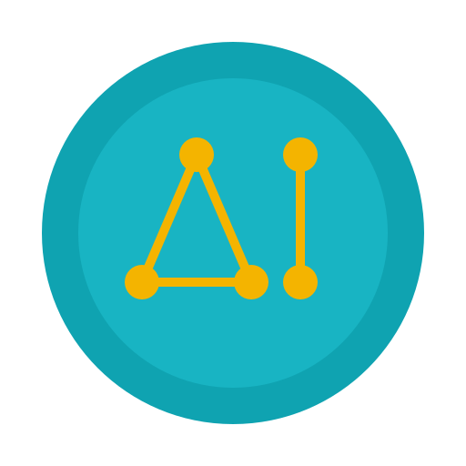

  

<h1 align="center">Omakai</h1>

Local-first AI development framework for shipping AI assistants.

<a href="https://omakai.org">omakai.org</a>

## Overview
Omakai is a local-first AI development framework that scaffolds, finetunes, tests, and packages AI assistants with a cohesive toolchain. It helps teams move from idea to a shippable AI without assembling a large stack.

## Tech stack (Elixir)
The stack is centered on Elixir/Erlang (OTP) for concurrency, distribution, and reliability.

Potential ecosystem components we may use:
- Phoenix + Plug: HTTP APIs and web runtime.
- Phoenix LiveView: interactive UI surfaces without heavy frontend JS.
- Phoenix PubSub + Presence: realtime events, channels, and multi-client state.
- Ecto: data access, migrations, validation, and multi-database support.
- SQLite/Postgres: persistence options depending on deployment footprint.
- Oban: durable background jobs and workflows.
- Broadway: backpressure-aware data ingestion pipelines.
- Nx/Axon + Explorer: numerical computing, model execution, and dataframes.
- Bumblebee: HuggingFace model integration on top of Nx.
- Livebook: reproducible notebooks for experiments, evals, and training recipes.
- Telemetry + OpenTelemetry: metrics, traces, and performance instrumentation.
- Finch/Tesla: HTTP clients for connectors and integrations.
- Release tooling (mix releases): repeatable, self-contained deployment artifacts.

## Key capabilities
- Project scaffolding for data, configs, tests, and UI surfaces.
- Data connectors for files, repos, and URLs.
- Training recipes that produce repeatable release bundles.
- Built-in testing via `omakai test` to run evals and gate releases.
- UI templates for AI interaction surfaces (CSS, Tailwind, or custom styling).
- Skill packs for common capabilities.
- Built-in coding assistant via `omakai code`.
- Release bundles with profiles and checksums.

## Typical workflow
- Run `omakai new` to scaffold a project through a wizard that sets AI parameters (name, languages, knowledge bases, tools, and chat/voice format).
- Use `omakai code` as the default way to build the AI with a coding agent.
- Add data through connectors.
- Enable skill packs.
- Run `omakai build` to build a local release bundle.
- Run `omakai start` to start the AI runtime.
- Customize UI and ship the release bundle.

## What ships
- Local-first runtime (no external systems, no API keys needed).
- End-to-end local stack for chat with a custom model.
- Release bundle that can be run, tested, and distributed.
